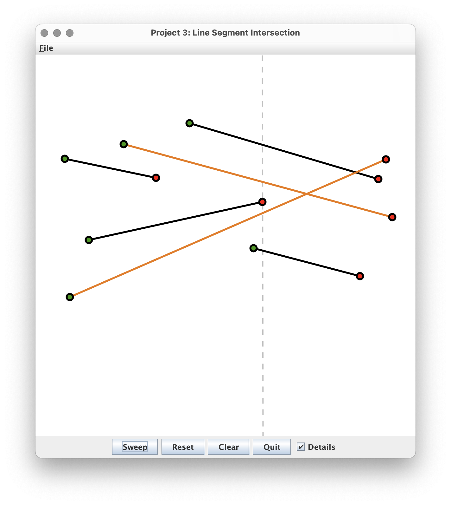

# Segment Intersection (BST)

**[Note]** This is a group project. Students may work in groups of 3 ~ 4 people, or by themselves.
  After completion, every group member submits their solutions on Autograder <mark>individually</mark>.

This project will be completed in 2 parts. This week you will write a BST, without worrying about 
keeping it balanced. Next week you will implement AVL rotations in order to achieve the optimal 
time complexity.


## Before We Start (Optional)

+ Review [lecture notes](./lectures/binary-search-trees.md) for binary search trees.
  (**HINT:** this will make writing `BinarySearchTree` really easy)


## Introduction



In this project, we consider a classic problem in computational
geometry: Given a set of `n` line segments, identify an intersecting
pair, if one exists. The naive approach is to check all possible pairs
for intersection. That is, for every line segment check whether it
intersects with every other line segment. We can determine if two
lines intersect in $O(1)$ time, so this algorithm requires $O(n^2)$ time to
examine all pairs. A better approach is to use a Line Sweep Algorithm
([CLRS](http://mitpress.mit.edu/9780262046305/introduction-to-algorithms/) Ch. 33.2),
which solves the problem in $O(n log(n))$ time.

A line segment is described by two endpoints, which we shall refer to
as the left endpoint (shown in green) and the right endpoint (shown in
red). In the first step of the algorithm, we sort all the endpoints by
their x-coordinates. This requires $O(n log(n))$ time in the worst
case. We then sweep a vertical line from left to right across the
plane. Each time the sweep line (shown as a dashed gray line) touches
an endpoint, the algorithm processes the event.

The main data structure is a binary search tree that, at any given
time, contains just those line segments that intersect the sweep
line. The segments are ordered in the tree according to the
y-coordinate of the point of where the segment intersects the sweep
line. For each endpoint the sweep line encounters as it passes across the plane, it
stops and takes one of the following actions depending on whether the
endpoint is green or red:

1. [green = left endpoint] Insert the line segment associated with
    this endpoint into the tree. Check for an intersection of this
    newly entered line segment with the one immediately above it on
    the sweep line. If they intersect, then highlight the two segments
    and stop. Otherwise, check for an intersection of this line segment with the
    one immediately below it on the sweep line. If they intersect,
    then highlight the two segments and stop. Otherwise, proceed with
    the sweep.

2. [red = right endpoint] Find the line segments immediately above and
    below this one on the sweep line. If they intersect, then
    highlight the two segments and stop. Otherwise, remove the line
    segment associated with this red endpoint from the tree and
    proceed with the sweep.

In the worst case, we need to process $O(n)$ endpoints. To achieve our
desired complexity of $O(n log(n))$, we need to process each endpoint in
$O(log(n))$ time. If we use a self-balancing binary search tree (such as
an AVL tree) to hold the line segments intersecting the sweep line,
then we can find the segments that are above and below a given segment
in $O(log(n))$ time.


## Student Support Code and Task Description

This week your task is to complete the implementation of the `BinarySearchTree` class.
⚠️**You are NOT supposed to modify any other code**
(marked as "read-only" in the project structure below).
Implement all of the methods marked `TODO` according to their descriptions
in the comments. **DO NOT** change their function signatures.
The `AVLTree` class is for next week, and is not required for this week's submission.


## Submission


As usual, this project contains a programming part and a testing part.
You are expected to test your code locally as you develop the program.

<!-- TODO: Link AG -->
+ Submit your code `BinarySearchTree.java` to the autograder SegmentIntersection project [here](https://autograder.luddy.indiana.edu/)
+ Submit your test cases `StudentTest.java` to the autograder SegmentIntersectionTest project [here](https://autograder.luddy.indiana.edu/)
  * We have included a small test case in the support code to get you started.


  ### Student Support Code [[🔗 link](https://github.com/IUDataStructuresCourse/segment-intersection-student-support-code)]
  
  ```
  .
  ├── SegmentIntersection.iml
  ├── src
  │   ├── AVLTree.java             // your code (next week)
  │   ├── BinarySearchTree.java    // your code (this week)
  │   ├── Constants.java
  │   ├── Driver.java
  │   ├── GUI.java
  │   ├── LineSegment.java
  │   ├── Node.java
  │   ├── OrderedSet.java
  │   └── Sweeper.java
  └── test
      └── StudentTest.java         // your tests
  ```
  
  Implementations of the GUI and the Line Sweep Algorithm are provided
  to you in full in the
  [student support code](https://github.com/IUDataStructuresCourse/segment-intersection-student-support-code).
  
  
  The `BinarySearchTree` class is an elaboration of the class described in lecture.
   
  Below is a summary of the components in the code base.
  However, before you begin writing any code, you need to understand the
  design of the interfaces in `OrderedSet.java`. So, that's the first place
  you should look.
  
  * `OrderedSet` [read-only] is an interface that describes the OrderedSet ADT
    through which the Line Sweep Algorithm will access the binary search tree. In
    this same file, you will find the interface definition for `Location`,
    which is used by `search()` to report the result of a
    look up. Furthermore, a `Location` must provide operations to access the
    previous and next elements with respect to inorder traversal,
    manifested by the `previous()` and `next()` methods. These methods
    are used by the Line Sweep Algorithm to determine the line segments
    that are immediately above or below the current segment.
  
  * `Node` [read-only] is a class implementing the `Location` interface.
    A `Node` contains the usual fields: `key`, `left`, and `right`, as well as
    two more fields: `parent` (which points to the node's parent in the
    tree) and `height` (which is the height of the subtree rooted at
    this node).
  
  * `BinarySearchTree` **[YOUR TASK]** is a generic class corresponding
    to a binary search tree. The ordering for the data in the tree
    is specified by a function of type `BiPredicate` and provided at
    construction time. Nodes in the tree are represented by the
    `Node` class. So that we can use `Node` as a return value from
    `search()`, `Node` implements the `Location` interface. 
  
  We maintain the height information in the tree nodes so that it is
  immediately available to us whenever we need it.
  This means that when a new node is inserted or removed from the tree,
  we may have to adjust the heights of the nodes along the path up to the root.
  
  Each node maintains a pointer to its parent node. We will require this
  information when implementing the `AVLTree`.
  The root has no parent so its parent is `null`.
  
  * `Constants` [read-only] is an interface containing a few global
    constants for the project.
  
  * `Driver` [read-only] is the main entry for the project. This is where
    you go to launch the GUI, draw the line segments, and run the sweep
    algorithm.
  
  * `GUI` [read-only] is the class that implements the graphical user
    interface.
  
  * `LineSegment` [read-only] is a class that represents a line
    segment. In this same file, you will find class definitions for
    Endpoint (and its subclasses, LeftEndpoint and RightEndpoint), and
    the SweepLine.
  
  * `Sweeper` [read-only] is the class that implements the Line Sweep
    Algorithm. Be sure to read through this code to help you understand
    how the algorithm works.
  
  ### Troubleshooting
  
  Here are a few common issues and things to remember as you complete the project 🙂
  - Remember that you need to update `parent` pointers for nodes, as well as `left` and `right` as you normally would
  - Remember to call `updateHeight` on nodes whenever their children change.
  - `BinarySearchTree` is responsible for maintaining the `numNodes` variable to track the size of the tree.
  